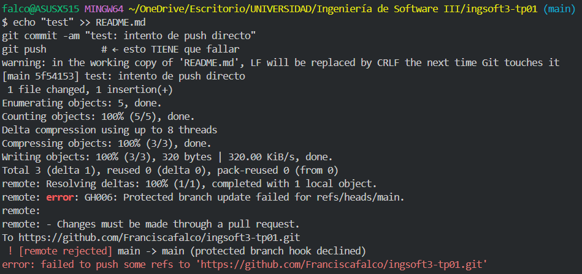
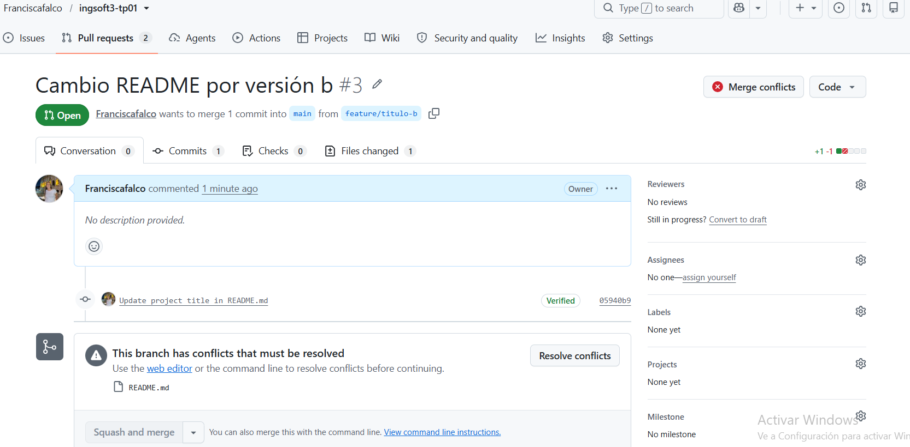
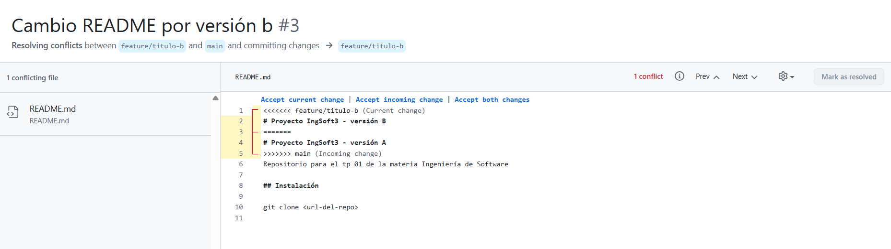
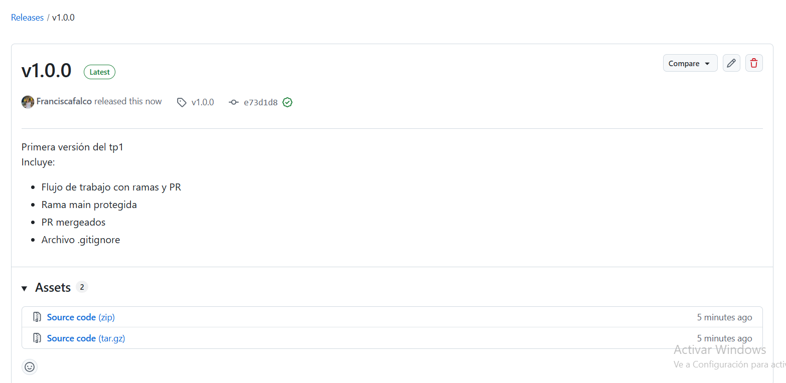

# Evidencias — TP1

## 1. Push directo a main rechazado


GitHub rechaza el push porque main está protegida y la regla alcanza también al dueño del repo.

## 2. El PR de la rama B no se puede mergear: conflicto


Github rechaza el merge por conflictos entre ramas.

## 3. Marcadores del conflicto en README.md


El editor de conflictos de GitHub muestra las dos versiones enfrentadas de la primera línea del README.Git no pudo resolverlo solo porque las dos ramas tocaron la misma línea , resolverlo es elegir el contenido a mano y borrar los marcadores.

## 4. Release v1.0.0 publicada


La release v1.0.0 publicada, con el resumen de qué incluye esta primera versión estable. El número es 1.0.0 por ser la primera entrega estable del TP.

# Evidencias — TP2

## 1. `docker compose up -d --build` desde cero, sistema funcionando end-to-end

Corrida limpia siguiendo exactamente los pasos del `README.md` (sin `.env` previo):

```
$ docker compose down -v
$ rm -f .env
$ cp .env.example .env
$ docker compose up -d --build
 Container ingsoft3-tp01-db-1  Started
 Container ingsoft3-tp01-db-1  Healthy
 Container ingsoft3-tp01-backend-1  Started
 Container ingsoft3-tp01-frontend-1  Started

$ curl -s http://localhost:8081/health
{"status":"ok"}
```

Y el frontend respondiendo en `http://localhost:3000`, hablando con el backend a través del proxy
de nginx (`/api`) — sin escribir ningún host ni puerto en el código del frontend:

```
$ curl -s -X POST localhost:3000/api/gastos -H "Content-Type: application/json" \
  -d '{"monto":500,"categoria":"salud","descripcion":"Farmacia","fecha":"2026-08-20T00:00:00Z"}'
{"id":1,"monto":500,"categoria":"salud","descripcion":"Farmacia","fecha":"2026-08-20T00:00:00Z","estado":"pendiente", ...}

$ curl -s localhost:3000/api/gastos
[{"id":1,"monto":500,"categoria":"salud", ...}]
```

Vista de la interfaz (listado + total, y resumen por categoría):

```
Total: $ 1.730,75

Fecha       Categoría     Descripción     Monto        Estado
14/8/2026   transporte    Nafta           $ 80,00      pendiente
9/8/2026    comida        Supermercado    $ 450,75     pendiente
31/7/2026   vivienda      Alquiler        $ 1.200,00   pendiente

--- pestaña Resumen ---
Total general: $ 1.730,75
comida: $ 450,75
transporte: $ 80,00
vivienda: $ 1.200,00
```

## 2. Prueba de persistencia

`down` (sin `-v`) conserva los datos; `down -v` los borra:

```
$ curl -s localhost:8081/api/gastos
[{"id":1,"monto":500, ...}]

$ docker compose down
$ docker compose up -d
$ curl -s localhost:8081/health
{"status":"ok"}
$ curl -s localhost:8081/api/gastos
[{"id":1,"monto":500, ...}]        # sigue el dato: el volumen sobrevivió

$ docker compose down -v
$ docker compose up -d
$ curl -s localhost:8081/health
{"status":"ok"}
$ curl -s localhost:8081/api/gastos
[]                                  # vacío: -v borró también el volumen
```

## 3. Comparación de tamaño: imagen final vs imagen del SDK/build

```
$ docker images | grep -E 'golang|node|nginx|ingsoft3-tp01'
ingsoft3-tp01-backend    latest        68.4MB
ingsoft3-tp01-frontend   latest        93.7MB
nginx                    alpine        93.3MB
golang                   1.25-alpine   329MB
node                     22-alpine     232MB
```

- **Backend**: 68.4 MB (final) vs 329 MB (imagen de build con el SDK de Go) — casi 5 veces más chica.
- **Frontend**: 93.7 MB (final, nginx + estáticos) vs 232 MB (imagen de build con Node) — más de 2 veces más chica, y básicamente el mismo peso que `nginx:alpine` solo, porque los estáticos de React pesan poco.

## 4. Imágenes publicadas en el registry

Push de las dos imágenes con tag semver `v0.1.0`:

```
$ docker push ghcr.io/franciscafalco/gastos-backend:v0.1.0
v0.1.0: digest: sha256:b6207220449dd19fcc73eac69d05eb9301d69c610a4cd1b6fe8e2128ab23716c size: 855

$ docker push ghcr.io/franciscafalco/gastos-frontend:v0.1.0
v0.1.0: digest: sha256:63add2fff23311b5cff75f5a364a6b616a3be6f4dc2a913faeec2757e5e9f5b9 size: 856
```

Prueba de que quedaron públicas de verdad: deslogueada de `ghcr.io` y sin la imagen local, el `pull`
igual funciona:

```
$ docker logout ghcr.io
Removing login credentials for ghcr.io

$ docker rmi ghcr.io/franciscafalco/gastos-backend:v0.1.0
$ docker pull ghcr.io/franciscafalco/gastos-backend:v0.1.0
v0.1.0: Pulling from franciscafalco/gastos-backend
Digest: sha256:b6207220449dd19fcc73eac69d05eb9301d69c610a4cd1b6fe8e2128ab23716c
Status: Downloaded newer image for ghcr.io/franciscafalco/gastos-backend:v0.1.0
```

Mismo resultado para `gastos-frontend`. Las dos imágenes se ven en la pestaña **Packages** de mi
perfil de GitHub con visibilidad **Public**.

Y `docker-compose.registry.yml` (usa `image:`, no `build:`) levantando el sistema completo a partir
de esas imágenes publicadas, sin el código fuente:

```
$ docker compose -f docker-compose.registry.yml up -d
$ curl -s localhost:8081/health
{"status":"ok"}
```
